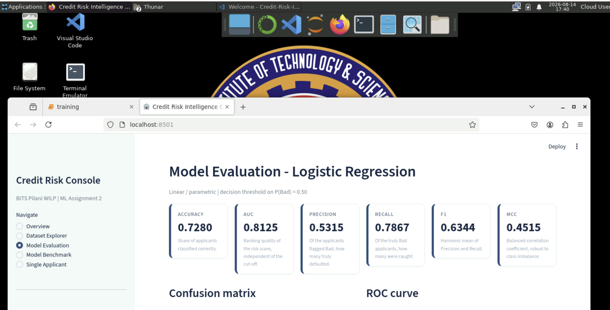
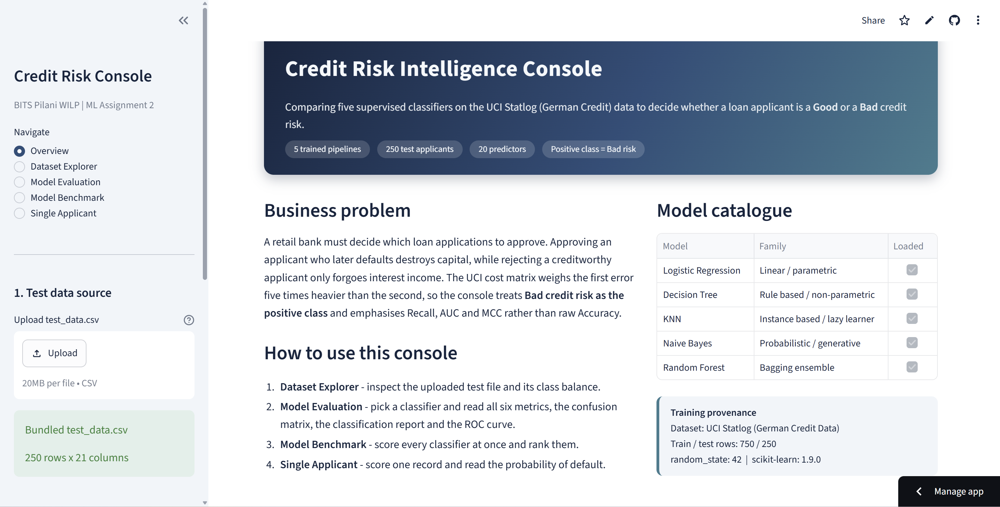
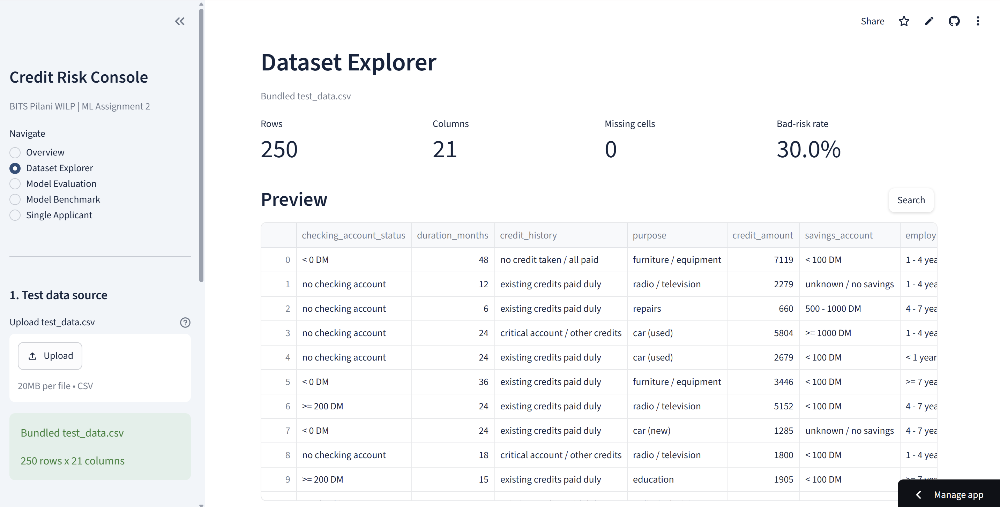
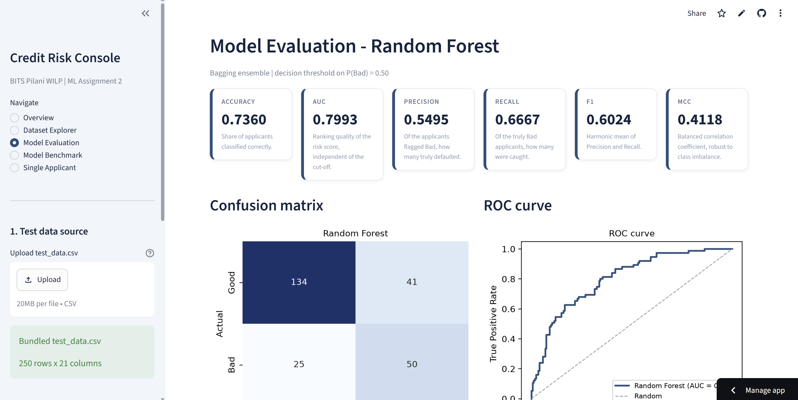
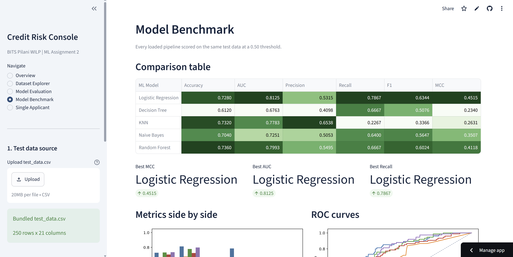
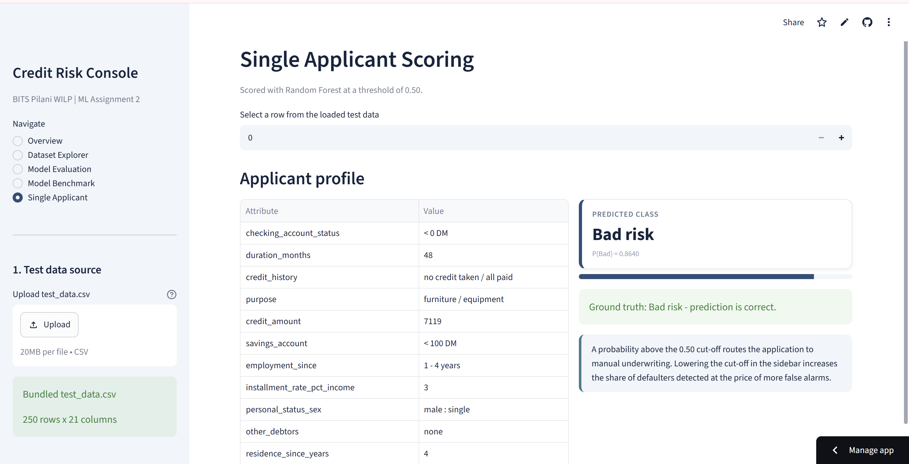

<style>
@page { size: A4; margin: 16mm 15mm 18mm 15mm; }

body {
  font-family: "Segoe UI", Calibri, "Helvetica Neue", Arial, sans-serif;
  font-size: 10.5pt;
  line-height: 1.5;
  color: #1a1a1a;
}

h1 { font-size: 21pt; color: #1f4e79; border-bottom: 3px solid #1f4e79;
     padding-bottom: 6px; margin: 0 0 4px; }
h2 { font-size: 15pt; color: #1f4e79; border-bottom: 1.5px solid #c8d6e5;
     padding-bottom: 4px; margin-top: 24px; page-break-before: always; }
h3 { font-size: 12.5pt; color: #24486b; margin-top: 18px; }
h4 { font-size: 11pt;   color: #24486b; margin-top: 14px; }
h5 { font-size: 10.5pt; color: #4a4a4a; font-style: italic; margin-top: 12px; }
h1, h2, h3, h4, h5 { page-break-after: avoid; }

p, li { orphans: 3; widows: 3; }

table { width: 100%; border-collapse: collapse; margin: 10px 0 14px;
        font-size: 9pt; page-break-inside: auto; }
thead { display: table-header-group; }
tr { page-break-inside: avoid; }
th, td { border: 1px solid #b9c6d4; padding: 5px 7px; text-align: left;
         vertical-align: top; }
th { background: #1f4e79; color: #ffffff; font-weight: 600; }
tbody tr:nth-child(even) td { background: #f2f6fa; }

img { max-width: 92%; height: auto; display: block; margin: 12px auto 4px;
      border: 1px solid #ccd4dc; page-break-inside: avoid; }

code { background: #f2f4f7; padding: 1px 4px; border-radius: 3px; font-size: 9pt; }
pre  { background: #f7f8fa; border: 1px solid #dde3ea; border-radius: 4px;
       padding: 8px 10px; font-size: 8.5pt; page-break-inside: avoid; }
pre code { background: none; padding: 0; }

blockquote { border-left: 4px solid #1f4e79; background: #f2f6fa;
             margin: 10px 0; padding: 6px 12px; }
hr { border: none; border-top: 1px solid #d5dde5; margin: 18px 0; }

.cover-meta td { border: none; padding: 3px 0; font-size: 11pt; }
.cover-meta td:first-child { width: 34%; color: #1f4e79; font-weight: 600; }
</style>

# Machine Learning Assignment 2 — Submission Report

**Work Integrated Learning Programmes Division — BITS Pilani**
**M.Tech (AIML / DSE) — Machine Learning — Assignment 2 (15 Marks)**

<table class="cover-meta">
<tr><td>Student Name</td><td>Madhusudan M</td></tr>
<tr><td>BITS ID</td><td>2025AD05091</td></tr>
<tr><td>Project Title</td><td>Credit Risk Intelligence Console</td></tr>
<tr><td>Dataset</td><td>UCI Statlog (German Credit Data)</td></tr>
<tr><td>GitHub Repository</td><td>github.com/2025ad05091/Credit-Risk-Intelligence</td></tr>
<tr><td>Live Application</td><td>credit-risk-intelligence-2025ad05091.streamlit.app</td></tr>
<tr><td>Submission Deadline</td><td>18 August 2026, 23:59 IST</td></tr>
</table>

### Contents

| Section | Title | Marks |
|---|---|---|
| 1 | Mandatory Submission Links | — |
| 2 | GitHub README Content | — |
| 3 | Dataset Description | 1 |
| 4 | Models Used and Evaluation Metrics | 5 |
| 5 | Observations on Model Performance | 3 |
| 6 | Streamlit Application | 4 |
| 7 | Final Conclusions | — |

## Section 1 — Mandatory Submission Links

### 1.1 GitHub Repository Link

**https://github.com/2025ad05091/Credit-Risk-Intelligence**

The repository contains the complete source code, `requirements.txt`, a full `README.md`
and the test data used in the experiments (`test_data.csv`).

| Required item | File in the repository |
|---|---|
| Complete source code | `app.py`, `notebooks/training.ipynb` |
| `requirements.txt` | `requirements.txt` |
| Clear `README.md` | `README.md` |
| Test data (CSV) | `test_data.csv` (250 labelled applicants) |
| Saved model files | `models/*.pkl` (five pipelines) + `models/metadata.json` |

### 1.2 Live Streamlit App Link

**<https://credit-risk-intelligence-2025ad05091.streamlit.app/>**

Deployed on Streamlit Community Cloud; the link opens an interactive front end with
sidebar navigation, a CSV uploader, a model dropdown, metric cards, confusion matrices,
classification reports and ROC curves.

### 1.3 BITS Virtual Lab Screenshot



The screenshot evidences the execution of this assignment on the BITS Virtual Lab and
shows the environment, the running project and a visible timestamp.

---

## Section 2 — GitHub README Content

The complete `README.md` from the repository is reproduced immediately below, exactly as
required by Section 2.4 of the assignment brief. It follows the mandated structure:
(a) problem statement, (b) dataset description, (c) GitHub repository link, (d) models
used with the comparison table, followed by the per-model observations and the overall
winner.

### Credit Risk Intelligence Console

**BITS Pilani WILP – M.Tech (AIML / DSE) – Machine Learning Assignment 2**

An end-to-end classification study on the UCI *Statlog (German Credit Data)* dataset:
five supervised classifiers are trained, evaluated on six metrics, and served through
an interactive Streamlit web application deployed on Streamlit Community Cloud.

#### a. Problem Statement

A retail bank receives far more loan applications than its underwriting team can review
manually. Each decision carries an **asymmetric cost**: approving an applicant who later
defaults destroys the principal that was lent out, whereas rejecting a creditworthy
applicant only forgoes the interest margin. The documentation accompanying the Statlog
German Credit dataset makes this explicit through a cost matrix in which classifying a
bad applicant as good is penalised **five times** more heavily than the reverse error.

**Objective.** Build a supervised binary classifier that consumes the 20 attributes
recorded at the time of application (account behaviour, credit history, loan purpose,
employment, demographics, collateral) and predicts whether the applicant represents a
**Good** or a **Bad** credit risk, so that:

* high-risk applications are routed automatically to manual underwriting,
* low-risk applications are fast-tracked for approval,
* the credit officer receives a calibrated probability rather than a bare label, and can
  move the decision threshold in line with the bank's risk appetite.

**Modelling convention.** Because the event of interest is a default, **`Bad` credit risk
is treated as the positive class (label 1)**. Consequently Precision, Recall and F1 are
reported for the `Bad` class, and Recall, AUC and MCC are weighted more heavily than raw
Accuracy when the winning model is selected. This is deliberate: the dataset is 70:30
imbalanced, so a degenerate classifier that approves everybody would already score 70 %
accuracy while catching zero defaulters.

#### b. Dataset Description

| Property | Value |
|---|---|
| **Name** | Statlog (German Credit Data) |
| **Source / Repository** | UCI Machine Learning Repository (ID 144) |
| **URL** | https://archive.ics.uci.edu/dataset/144/statlog+german+credit+data |
| **Donor** | Prof. Dr. Hans Hofmann, Universität Hamburg |
| **Task** | Binary classification |
| **Number of rows (instances)** | **1,000** (requirement ≥ 500 ✔) |
| **Number of columns** | **21** = 20 predictors + 1 target (requirement ≥ 12 features ✔) |
| **Predictor composition** | 7 numerical + 13 categorical attributes |
| **Design matrix after one-hot encoding** | 61 columns |
| **Target variable** | `credit_risk` ∈ {`Good`, `Bad`} |
| **Class distribution** | `Good` = 700 (70.0 %), `Bad` = 300 (30.0 %) |
| **Missing values** | 0 cells |
| **Duplicate rows** | 0 |
| **Train / test split** | Stratified 75 / 25 → 750 train, 250 test (`random_state = 42`) |
| **Test-set class balance** | `Good` = 175, `Bad` = 75 (30.0 % preserved) |

##### Justification for the dataset choice

1. **Satisfies both constraints comfortably** – 1,000 records and 20 predictors exceed the
   mandated minimums of 500 instances and 12 features.
2. **Genuinely mixed data types** – 13 qualitative and 7 quantitative attributes force a
   real preprocessing pipeline (imputation, one-hot encoding, scaling) instead of a
   trivial `fit` on an already-numeric matrix.
3. **Realistic class imbalance** – the 70:30 split makes Accuracy an insufficient
   criterion and gives AUC and MCC a meaningful role, which is exactly what the six
   mandated metrics are designed to expose.
4. **Discriminates between model families** – the target depends on both smooth monotone
   effects (loan duration, credit amount) and sharp categorical effects (checking-account
   status, credit history), so linear, tree-based, instance-based and probabilistic
   learners produce genuinely different results rather than a five-way tie.
5. **Interpretable business narrative** – every attribute maps to a quantity a credit
   officer actually observes, so the model outputs can be explained to a non-technical
   stakeholder.

##### Attribute dictionary

| # | Attribute | Type | Description |
|---|---|---|---|
| 1 | `checking_account_status` | Categorical | Balance band of the existing checking account |
| 2 | `duration_months` | Numerical | Loan duration in months |
| 3 | `credit_history` | Categorical | Repayment record on previous credits |
| 4 | `purpose` | Categorical | Purpose of the loan (car, education, business, …) |
| 5 | `credit_amount` | Numerical | Requested credit amount (DM) |
| 6 | `savings_account` | Categorical | Balance band of savings account / bonds |
| 7 | `employment_since` | Categorical | Length of current employment |
| 8 | `installment_rate_pct_income` | Numerical | Instalment as a percentage of disposable income |
| 9 | `personal_status_sex` | Categorical | Marital status and sex |
| 10 | `other_debtors` | Categorical | Co-applicant or guarantor present |
| 11 | `residence_since_years` | Numerical | Years at the present residence |
| 12 | `property_type` | Categorical | Most valuable asset owned |
| 13 | `age_years` | Numerical | Age of the applicant |
| 14 | `other_installment_plans` | Categorical | Instalment plans at banks or stores |
| 15 | `housing` | Categorical | Rent / own / for free |
| 16 | `existing_credits_at_bank` | Numerical | Number of credits held at this bank |
| 17 | `job` | Categorical | Skill level of the occupation |
| 18 | `dependents` | Numerical | Number of dependants |
| 19 | `telephone` | Categorical | Telephone registered in the applicant's name |
| 20 | `foreign_worker` | Categorical | Foreign-worker flag |
| 21 | `credit_risk` | **Target** | `Good` (1) / `Bad` (2) in the raw file |

The raw UCI file encodes every qualitative value as an opaque token (`A11`, `A34`, …).
The training notebook decodes these into readable business labels using the mapping in
`german.doc`, so `test_data.csv` and the Streamlit UI are directly human-interpretable.

#### c. GitHub Repository Link

**Repository:** https://github.com/2025ad05091/Credit-Risk-Intelligence

##### Repository contents

```text
Credit-Risk-Intelligence/
├── app.py                       # Streamlit web application (deployment entry point)
├── requirements.txt             # Pinned runtime dependencies
├── README.md                    # This document
├── test_data.csv                # Held-out test set (250 labelled applicants)
│
├── data/
│   ├── german.data              # Raw UCI file
│   ├── german.doc               # Official UCI attribute documentation
│   └── german_credit_clean.csv  # Decoded, analysis-ready dataset (1,000 rows)
│
├── models/                      # Serialised end-to-end scikit-learn pipelines
│   ├── logistic_regression.pkl
│   ├── decision_tree.pkl
│   ├── knn.pkl
│   ├── naive_bayes.pkl
│   ├── random_forest.pkl
│   └── metadata.json            # Schema, positive class, versions, split sizes
│
├── notebooks/
│   └── training.ipynb           # EDA → preprocessing → training → evaluation → export
│
└── reports/
    ├── evaluation_results.csv       # The comparison table below
    ├── cross_validation_results.csv # Selected hyper-parameters and CV AUC
    ├── figures/                     # All plots produced by the notebook
    └── screenshots/                 # BITS Virtual Lab execution evidence
```

Each `.pkl` file stores a **complete `Pipeline`** (`ColumnTransformer` → estimator), not a
bare estimator. The application therefore feeds raw, human-readable rows straight to
`predict()`; imputation, one-hot encoding and scaling are replayed with the statistics
learned on the training fold, which makes train/serve skew structurally impossible.

#### d. Models Used

All five algorithms are trained on the **identical 750-row training partition** with the
identical preprocessing block, so the comparison isolates the effect of the learning
algorithm alone.

##### Preprocessing (shared by every model)

| Block | Steps |
|---|---|
| 7 numerical columns | median imputation → `StandardScaler` |
| 13 categorical columns | most-frequent imputation → `OneHotEncoder(handle_unknown="ignore")` |

Scaling is indispensable for KNN (a distance-based learner) and beneficial for the
convergence of regularised Logistic Regression; it is harmless for the tree ensembles.
`handle_unknown="ignore"` guarantees that an uploaded CSV containing a previously unseen
category degrades gracefully instead of crashing the deployed app.

##### Model descriptions and selected hyper-parameters

Hyper-parameters were tuned with a **5-fold stratified `GridSearchCV` optimised for
`roc_auc`** on the training data only; the test set was touched exactly once, at the end.

| Model | What it does | Selected hyper-parameters | CV AUC (mean ± sd) |
|---|---|---|---|
| **Logistic Regression** | Models the log-odds of default as a linear combination of the encoded features; produces smooth, well-ordered probabilities and signed, interpretable coefficients. | `C = 0.05`, `penalty = l2`, `class_weight = balanced` | 0.7791 ± 0.0210 |
| **Decision Tree** | Recursively partitions the feature space into axis-parallel regions using Gini impurity; yields fully transparent if-then rules. | `criterion = gini`, `max_depth = 7`, `min_samples_leaf = 20`, `class_weight = balanced` | 0.7621 ± 0.0162 |
| **K-Nearest Neighbours** | Lazy learner that classifies an applicant by the distance-weighted vote of its 31 nearest neighbours in the standardised 61-dimensional space. | `n_neighbors = 31`, `weights = distance`, `p = 1` (Manhattan) | 0.7548 ± 0.0332 |
| **Naive Bayes (Gaussian)** | Generative classifier applying Bayes' theorem under the assumption that features are conditionally independent given the class. | `var_smoothing = 1e-3` | 0.7174 ± 0.0471 |
| **Random Forest (Ensemble)** | Bagged ensemble of 600 de-correlated trees; each tree sees a bootstrap sample and a random feature subset, and the votes are averaged to cut variance. | `n_estimators = 600`, `max_depth = None`, `min_samples_leaf = 3`, `max_features = sqrt`, `class_weight = balanced` | **0.7926 ± 0.0139** |

`class_weight = "balanced"` is enabled wherever the estimator supports it, so that the
learner internally re-weights the minority `Bad` class in proportion to the bank's
asymmetric cost. Gaussian Naive Bayes and KNN do not expose that parameter, and this
limitation is visible in their results below.

##### Comparison Table — evaluation metrics on the held-out test set (250 applicants)

Positive class = `Bad` credit risk. Decision threshold = 0.50.

| ML Model Name | Accuracy | AUC | Precision | Recall | F1 | MCC |
|---|---|---|---|---|---|---|
| Logistic Regression | 0.7280 | **0.8125** | 0.5315 | **0.7867** | **0.6344** | **0.4515** |
| Decision Tree | 0.6120 | 0.6763 | 0.4098 | 0.6667 | 0.5076 | 0.2340 |
| kNN | 0.7320 | 0.7783 | **0.6538** | 0.2267 | 0.3366 | 0.2631 |
| Naive Bayes | 0.7040 | 0.7251 | 0.5053 | 0.6400 | 0.5647 | 0.3507 |
| Random Forest (Ensemble) | **0.7360** | 0.7993 | 0.5495 | 0.6667 | 0.6024 | 0.4118 |

*(Reproducible from `reports/evaluation_results.csv`; regenerate by running
`notebooks/training.ipynb` with `random_state = 42`.)*

Confusion-matrix breakdown on the same 250 applicants (175 Good, 75 Bad):

| ML Model Name | True Neg | False Pos | False Neg | True Pos | Defaulters missed |
|---|---|---|---|---|---|
| Logistic Regression | 123 | 52 | **16** | **59** | 16 / 75 |
| Decision Tree | 103 | 72 | 25 | 50 | 25 / 75 |
| kNN | **166** | **9** | 58 | 17 | 58 / 75 |
| Naive Bayes | 128 | 47 | 27 | 48 | 27 / 75 |
| Random Forest (Ensemble) | 134 | 41 | 25 | 50 | 25 / 75 |

#### e. Observations on Model Performance

##### Logistic Regression

**The strongest model overall.** It records the best AUC (0.8125), F1 (0.6344) and MCC (0.4515), and catches 59 of the 75 defaulters — the highest recall in the study at 0.7867. Its accuracy (0.7280) is marginally below Random Forest's, but that gap is entirely explained by its willingness to trade false alarms for detected defaults, which is precisely the trade-off the 5:1 cost matrix demands.

The reason it performs so well is that credit risk in this dataset is dominated by a handful of strong, roughly monotone signals — checking-account balance, loan duration, credit history, credit amount — whose effect on the log-odds is close to additive. With only 750 training rows spread over 61 encoded columns, the strong L2 penalty selected by cross-validation (`C = 0.05`) keeps variance low and generalisation high, whereas the more flexible learners exhaust the limited data. It also delivers the most stable probability ranking, which matters because the deployed console lets the credit officer move the cut-off. Weakness: it cannot represent interactions unless they are engineered manually.

##### Decision Tree

**The weakest model on every headline metric** — accuracy 0.6120, AUC 0.6763, MCC 0.2340 — despite cross-validated pruning to `max_depth = 7` and `min_samples_leaf = 20`. The failure mode is visible in its confusion matrix: 72 of 175 creditworthy applicants are wrongly rejected, the worst false-positive count in the study.

A single tree carves the space with hard axis-parallel splits, so a small perturbation in the data reroutes entire branches; with 750 rows and 61 encoded columns the estimated split points are simply too noisy. Its probability output is also coarse — every record in the same leaf shares one probability — which flattens the ROC curve and depresses AUC. Its redeeming quality is interpretability: the fitted rules can be printed and audited by a credit-risk committee, and it is the natural base learner whose variance the Random Forest is built to eliminate.

##### kNN

**A misleading result that illustrates why accuracy alone is inadequate.** kNN posts a respectable accuracy of 0.7320 and by far the best precision (0.6538), yet its recall collapses to 0.2267 and its MCC (0.2631) is second-worst. The confusion matrix explains the paradox: it flags only 26 applicants as risky, catching 17 true defaulters while missing 58 — nearly four out of five.

Because the algorithm has no `class_weight` parameter, each of the 31 neighbours votes with equal force in a training set where good applicants outnumber bad ones 7:3, so the majority class systematically dominates the neighbourhood vote. The problem is compounded by the curse of dimensionality: after one-hot encoding, the 61-dimensional space is sparse and Manhattan distances between applicants become nearly uniform, weakening the notion of "nearest". Its AUC of 0.7783 shows the underlying ranking is actually reasonable — the model is handicapped by the 0.50 cut-off, not by a lack of signal, and lowering the threshold in the app materially improves its recall.

##### Naive Bayes

**A solid mid-table performer with a favourable effort-to-accuracy ratio** — accuracy 0.7040, AUC 0.7251, recall 0.6400, MCC 0.3507. It trains in milliseconds with a single hyper-parameter and still beats the Decision Tree on every metric, confirming that a simple generative model can be competitive on small tabular data.

Its handicap is structural: the conditional-independence assumption is clearly violated here, since `credit_amount` and `duration_months` are strongly correlated (longer loans are larger loans) and `job`, `employment_since` and `housing` overlap heavily. Treating these as independent double-counts the evidence and pushes the posterior probabilities toward 0 or 1, which is why its AUC trails Logistic Regression by almost nine points even though the two models achieve comparable recall. Applying the Gaussian likelihood to one-hot indicator columns is a further approximation. It is best regarded as a fast, sensible baseline rather than a production candidate.

##### Random Forest (Ensemble)

**The best cross-validated model (CV AUC 0.7926, the lowest variance at ±0.0139) and the runner-up on the test set** — the highest test accuracy (0.7360) and the second-best AUC (0.7993), F1 (0.6024) and MCC (0.4118). Bagging 600 de-correlated trees does exactly what the theory predicts: it eliminates the single tree's instability and lifts MCC from 0.2340 to 0.4118, an increase of 76 %, while cutting false positives from 72 to 41.

Its feature-importance ranking independently corroborates the domain narrative, placing checking-account status, loan duration and credit amount at the top. The reason it does not overtake Logistic Regression on the test set is that its extra capacity is spent modelling interactions that the 750-row training sample cannot support reliably, and its averaged votes are more conservative near the 0.50 boundary, so it misses 25 defaulters against Logistic Regression's 16. It is the most robust choice if the bank later enlarges the training data, and it requires no distributional assumptions or manual feature engineering. Costs: an 8.5 MB artefact and far lower transparency than a single tree or a linear model.

##### Overall Winner for this dataset

> **Logistic Regression** is the overall winner on the German Credit dataset,
> with **Random Forest** a very close second.

**Evidence from the metrics.**

1. **It wins the three metrics that matter for this problem.** MCC 0.4515 vs 0.4118 for
   Random Forest, F1 0.6344 vs 0.6024, and AUC 0.8125 vs 0.7993. MCC is the decisive
   criterion because it is the only metric here that incorporates all four cells of the
   confusion matrix and stays honest under the 70:30 imbalance.
2. **It minimises the expensive error.** It misses only **16 of 75 defaulters**, against
   25 for Random Forest, 27 for Naive Bayes and 58 for kNN. Under the UCI cost matrix
   (5 units per missed default, 1 unit per rejected good applicant) its total cost is
   `5 × 16 + 1 × 52 = 132`, the lowest of the five models — Random Forest scores
   `5 × 25 + 1 × 41 = 166` and kNN a poor `5 × 58 + 1 × 9 = 299`.
3. **Its accuracy deficit is immaterial.** Random Forest leads on accuracy by only
   0.8 percentage points (0.7360 vs 0.7280), i.e. two applicants out of 250 — well inside
   sampling noise, and irrelevant once the asymmetric cost is applied. Note that kNN's
   apparently competitive 0.7320 accuracy is barely above the 70 % no-skill baseline.
4. **Its ranking quality is the best available.** The highest AUC means it orders
   applicants by risk more faithfully than any competitor, which is what the deployed
   console needs when the credit officer moves the decision threshold.
5. **Secondary advantages.** It is the smallest artefact (8.9 KB vs 8.5 MB), the fastest
   to score, and the only model whose signed coefficients can be shown to a regulator —
   a decisive consideration in credit decisioning, where adverse-action reasons must be
   disclosed.

**Caveat.** Random Forest achieved the best *cross-validated* AUC with the tightest
standard deviation, so its lower test score partly reflects the modest 250-row test set.
The practical recommendation is to deploy Logistic Regression as the primary scorer and
retain Random Forest as a challenger model, re-evaluating both once more data accrues.

#### f. Streamlit Application

**Live app:** <https://credit-risk-intelligence-2025ad05091.streamlit.app/>

##### Mandatory features (mapped to the assignment rubric)

| Requirement | Where it is implemented |
|---|---|
| **a. Dataset upload option (CSV, test data only)** | Sidebar → *Test data source* → file uploader. Falls back to the bundled `test_data.csv` when nothing is uploaded, and validates the uploaded schema against `models/metadata.json`. |
| **b. Model selection dropdown** | Sidebar → *Model selection* → `st.selectbox` listing all five classifiers. |
| **c. Display of evaluation metrics** | *Model Evaluation* page shows Accuracy, AUC, Precision, Recall, F1 and MCC as styled KPI cards; *Model Benchmark* scores all five models at once in one comparison table. |
| **d. Confusion matrix / classification report** | *Model Evaluation* page renders **both** an annotated confusion matrix and a full per-class classification report, plus the ROC curve. |

##### Additional features

* **Five-page sidebar navigation** – Overview, Dataset Explorer, Model Evaluation, Model
  Benchmark, Single Applicant.
* **Adjustable decision threshold** – a slider on `P(Bad)` lets the user trade recall
  against precision live and watch every metric respond, which turns the cost asymmetry
  discussed above into something the evaluator can see.
* **Model Benchmark page** – scores all five pipelines on the uploaded data
  simultaneously, ranks them, overlays their ROC curves and reports the winner by MCC,
  AUC and Recall.
* **Dataset Explorer** – row/column counts, missing-value audit, class balance, and a
  per-feature distribution chart that adapts to numerical or categorical attributes.
* **Single Applicant scoring** – inspect one record, read its probability of default and
  compare the prediction against the ground truth.
* **CSV downloads** – scored predictions and the comparison table.
* **Business reading panel** – translates the confusion matrix into defaulters caught,
  defaulters missed and creditworthy applicants wrongly rejected.
* **Robustness** – missing files, malformed CSVs, absent target columns and unseen
  categories are all handled with explicit user-facing messages rather than tracebacks.

#### g. Installation

> **Python version:** 3.11 or newer is required (`scikit-learn 1.9.0` and
> `pandas 3.0` both drop support below 3.11). The project is developed and
> verified on CPython **3.14.3**; 3.11, 3.12 and 3.13 also work.

```bash
# 1. Clone the repository
git clone https://github.com/2025ad05091/Credit-Risk-Intelligence.git
cd Credit-Risk-Intelligence

# 2. Create and activate a virtual environment
python -m venv .venv

#    Linux / macOS
source .venv/bin/activate
#    Windows (PowerShell)
.venv\Scripts\Activate.ps1

# 3. Install the dependencies
pip install --upgrade pip
pip install -r requirements.txt
```

#### h. Run Locally

```bash
# Launch the Streamlit console (opens at http://localhost:8501)
streamlit run app.py
```

To retrain every model from scratch and regenerate the pickles, the comparison table and
all figures:

```bash
jupyter notebook notebooks/training.ipynb     # then Kernel → Restart & Run All
```

or head-lessly:

```bash
jupyter nbconvert --to notebook --execute --inplace notebooks/training.ipynb
```

With `random_state = 42` fixed throughout, the regenerated numbers reproduce the
comparison table above exactly.

##### Using the app

1. Open the sidebar and either upload `test_data.csv` or keep the bundled copy.
2. Pick a classifier from the dropdown.
3. Open **Model Evaluation** for the six metrics, the confusion matrix, the
   classification report and the ROC curve of that model.
4. Open **Model Benchmark** to compare all five models on the same data.
5. Move the threshold slider to explore the precision/recall trade-off.

#### i. Deployment on Streamlit Community Cloud

1. Push the repository to GitHub (`app.py`, `requirements.txt`, `models/`, `test_data.csv`
   must all be committed — `models/*.pkl` are **not** to be git-ignored).
2. Go to https://streamlit.io/cloud and sign in with the GitHub account.
3. Click **New app**.
4. Select the repository `2025ad05091/Credit-Risk-Intelligence`.
5. Choose the branch `main`.
6. Set the main file path to `app.py`.
7. Click **Deploy** and wait for the build to finish.
8. Verify that the deployed URL opens, that all five models load, and that the metrics
   render without errors.

**Deployment note.** `scikit-learn` and `joblib` are pinned to the exact versions used to
serialise the pipelines, because unpickling an estimator under a different scikit-learn
release triggers `InconsistentVersionWarning` and can fail. Missing or mismatched
dependencies are the most common cause of a failed Streamlit Cloud build.

#### j. Reproducibility

| Control | Setting |
|---|---|
| Global seed | `random_state = 42` for the split, the trees, the forest and the CV folds |
| Split strategy | `train_test_split(test_size=0.25, stratify=y, random_state=42)` |
| CV strategy | `StratifiedKFold(n_splits=5, shuffle=True, random_state=42)` |
| Leakage control | Every transformer is fitted inside a `Pipeline` on the training fold only |
| Environment | Versions recorded in `models/metadata.json` and pinned in `requirements.txt` |

#### k. Repository Hygiene and Academic Integrity

* All code in this repository was written specifically for this assignment; no template
  repository was cloned or copied.
* The dataset is publicly available from the UCI Machine Learning Repository and is
  redistributed here in its original form together with the official `german.doc`
  documentation for auditability.
* Every number quoted in this README was produced by executing
  `notebooks/training.ipynb` and can be regenerated from `reports/evaluation_results.csv`.
* The assignment was executed on the BITS Virtual Lab; the evidence screenshot is stored
  in `reports/screenshots/` and included in the submitted PDF.

#### References

1. Hofmann, H. (1994). *Statlog (German Credit Data)*. UCI Machine Learning Repository.
   https://doi.org/10.24432/C5NC77
2. Pedregosa, F. et al. (2011). Scikit-learn: Machine Learning in Python.
   *Journal of Machine Learning Research*, 12, 2825–2830.
3. Chicco, D., & Jurman, G. (2020). The advantages of the Matthews correlation
   coefficient (MCC) over F1 score and accuracy in binary classification evaluation.
   *BMC Genomics*, 21(6).

---

## Section 3 — Dataset Description *(1 mark)*

| Property | Value |
|---|---|
| Name | Statlog (German Credit Data) |
| Source | UCI Machine Learning Repository, dataset ID 144 |
| URL | https://archive.ics.uci.edu/dataset/144/statlog+german+credit+data |
| Task | Binary classification |
| Instances | **1,000** (requirement ≥ 500 ✔) |
| Columns | **21** = 20 predictors + 1 target (requirement ≥ 12 features ✔) |
| Predictor mix | 7 numerical + 13 categorical |
| Encoded design matrix | 61 columns after one-hot encoding |
| Target | `credit_risk` ∈ {Good, Bad} |
| Class distribution | Good = 700 (70 %), Bad = 300 (30 %) |
| Missing values / duplicates | 0 / 0 |
| Split | Stratified 75 / 25 → 750 train, 250 test, `random_state = 42` |

**Why this dataset.** It exceeds both size constraints, mixes qualitative and quantitative
attributes so that a genuine preprocessing pipeline is required, carries a realistic 70:30
imbalance that makes AUC and MCC meaningful, and contains both smooth and sharply
categorical signals so that the five algorithm families produce genuinely different
results. Every attribute maps to a quantity a credit officer actually observes, which
makes the outputs explainable to a business stakeholder.

---

## Section 4 — Models Used and Evaluation Metrics *(5 marks)*

All five algorithms were trained on the same 750-row training partition with an identical
preprocessing block (median/most-frequent imputation → one-hot encoding → standard
scaling), each wrapped in a scikit-learn `Pipeline` so that no information leaks from the
test set. Hyper-parameters were chosen by 5-fold stratified `GridSearchCV` optimised for
`roc_auc` on the training data only.

**Positive class = `Bad` credit risk.** Decision threshold = 0.50. Test set = 250 unseen
applicants (175 Good, 75 Bad).

### 4.1 Comparison Table

| ML Model Name | Accuracy | AUC | Precision | Recall | F1 | MCC |
|---|---|---|---|---|---|---|
| Logistic Regression | 0.7280 | **0.8125** | 0.5315 | **0.7867** | **0.6344** | **0.4515** |
| Decision Tree | 0.6120 | 0.6763 | 0.4098 | 0.6667 | 0.5076 | 0.2340 |
| kNN | 0.7320 | 0.7783 | **0.6538** | 0.2267 | 0.3366 | 0.2631 |
| Naive Bayes | 0.7040 | 0.7251 | 0.5053 | 0.6400 | 0.5647 | 0.3507 |
| Random Forest (Ensemble) | **0.7360** | 0.7993 | 0.5495 | 0.6667 | 0.6024 | 0.4118 |

### 4.2 Confusion-matrix breakdown

| ML Model Name | TN | FP | FN | TP | Defaulters missed | Cost (5·FN + 1·FP) |
|---|---|---|---|---|---|---|
| Logistic Regression | 123 | 52 | **16** | **59** | 16 / 75 | **132** |
| Decision Tree | 103 | 72 | 25 | 50 | 25 / 75 | 197 |
| kNN | **166** | **9** | 58 | 17 | 58 / 75 | 299 |
| Naive Bayes | 128 | 47 | 27 | 48 | 27 / 75 | 182 |
| Random Forest (Ensemble) | 134 | 41 | 25 | 50 | 25 / 75 | 166 |

### 4.3 Selected hyper-parameters and cross-validated AUC

| Model | Best parameters | CV AUC (mean ± sd) |
|---|---|---|
| Logistic Regression | `C = 0.05`, `penalty = l2`, balanced | 0.7791 ± 0.0210 |
| Decision Tree | `gini`, `max_depth = 7`, `min_samples_leaf = 20`, balanced | 0.7621 ± 0.0162 |
| kNN | `n_neighbors = 31`, `weights = distance`, `p = 1` | 0.7548 ± 0.0332 |
| Naive Bayes | `var_smoothing = 1e-3` | 0.7174 ± 0.0471 |
| Random Forest | `600` trees, `min_samples_leaf = 3`, `max_features = sqrt`, balanced | **0.7926 ± 0.0139** |

---

## Section 5 — Observations on Model Performance *(3 marks)*

| ML Model Name | Headline observation |
|---|---|
| Logistic Regression | Strongest overall — best AUC, F1 and MCC, and the highest recall at 0.7867 |
| Decision Tree | Weakest on every headline metric; worst false-positive count at 72 |
| kNN | High precision but recall collapses to 0.2267 — misses 58 of 75 defaulters |
| Naive Bayes | Solid mid-table baseline; independence assumption clearly violated |
| Random Forest | Best cross-validated model and test-set runner-up on AUC, F1 and MCC |

Each model is discussed in full below.

### 5.1 Logistic Regression

The strongest model overall. It records the best AUC (0.8125), F1 (0.6344) and MCC
(0.4515), and the highest recall in the study at 0.7867, catching 59 of the 75
defaulters. Its accuracy (0.7280) sits marginally below Random Forest's, but that gap is
entirely explained by its willingness to trade false alarms for detected defaults —
precisely the trade-off the 5:1 cost matrix demands.

It performs well because credit risk in this dataset is dominated by a handful of strong,
roughly monotone signals — checking-account balance, loan duration, credit history and
credit amount — whose effect on the log-odds is close to additive, so a linear decision
boundary is well specified. With only 750 training rows spread over 61 encoded columns,
the strong L2 penalty selected by cross-validation (`C = 0.05`) keeps variance low and
generalisation high, whereas the more flexible learners exhaust the limited data. It also
delivers the most stable probability ranking, which matters because the deployed console
lets the credit officer move the cut-off.

*Limitation:* it cannot represent interactions unless they are engineered manually.

### 5.2 Decision Tree

The weakest model on every headline metric — accuracy 0.6120, AUC 0.6763, MCC 0.2340 —
despite cross-validated pruning to `max_depth = 7` and `min_samples_leaf = 20`. The
failure mode is visible in its confusion matrix: 72 of 175 creditworthy applicants are
wrongly rejected, the worst false-positive count in the study.

A single tree carves the space with hard axis-parallel splits, so a small perturbation in
the data reroutes entire branches; with 750 rows over 61 encoded columns the estimated
split points are simply too noisy. Its probability output is also coarse — every record
in the same leaf shares one probability — which flattens the ROC curve and depresses AUC.

*Redeeming quality:* interpretability. The fitted rules can be printed and audited by a
credit-risk committee, and it is the natural base learner whose variance the Random
Forest is built to eliminate.

### 5.3 K-Nearest Neighbours

A cautionary result that illustrates why accuracy alone is inadequate. kNN posts a
respectable accuracy of 0.7320 and by far the best precision (0.6538), yet its recall
collapses to 0.2267 and its MCC (0.2631) is second-worst. The confusion matrix explains
the paradox: it flags only 26 applicants as risky, catching 17 true defaulters while
missing 58 — nearly four out of five.

Two mechanisms drive this. First, the algorithm exposes no `class_weight` parameter, so
each of the 31 neighbours votes with equal force in a training set where good applicants
outnumber bad ones 7:3, and the majority class systematically dominates every
neighbourhood. Second, the curse of dimensionality compounds it: after one-hot encoding,
the 61-dimensional space is sparse and Manhattan distances between applicants become
nearly uniform, weakening the very notion of "nearest".

Its AUC of 0.7783 shows the underlying ranking is actually sound — the model is
handicapped by the 0.50 cut-off, not by a lack of signal, and lowering the threshold in
the app materially improves its recall.

### 5.4 Naive Bayes (Gaussian)

A solid mid-table performer with a favourable effort-to-accuracy ratio — accuracy 0.7040,
AUC 0.7251, recall 0.6400, MCC 0.3507. It trains in milliseconds with a single
hyper-parameter and still beats the Decision Tree on every metric, confirming that a
simple generative model can be competitive on small tabular data.

Its handicap is structural: the conditional-independence assumption is clearly violated
here, since `credit_amount` and `duration_months` are strongly correlated (longer loans
are larger loans) and `job`, `employment_since` and `housing` overlap heavily. Treating
these as independent double-counts the evidence and pushes the posterior probabilities
toward 0 or 1, which is why its AUC trails Logistic Regression by almost nine points even
though the two models achieve comparable recall. Applying the Gaussian likelihood to
one-hot indicator columns is a further approximation.

*Assessment:* a fast, sensible baseline rather than a production candidate.

### 5.5 Random Forest (Ensemble)

The best cross-validated model (CV AUC 0.7926, the lowest variance at ± 0.0139) and the
runner-up on the test set — the highest test accuracy (0.7360) and the second-best AUC
(0.7993), F1 (0.6024) and MCC (0.4118).

Bagging 600 de-correlated trees does exactly what theory predicts: it eliminates the
single tree's instability, lifting MCC from 0.2340 to 0.4118 — a 76 % gain — while
cutting false positives from 72 to 41. Its feature-importance ranking independently
corroborates the domain narrative, placing checking-account status, loan duration and
credit amount at the top.

It does not overtake Logistic Regression on the test set because its extra capacity is
spent modelling interactions that the 750-row training sample cannot support reliably,
and its averaged votes are more conservative near the 0.50 boundary, so it misses 25
defaulters against Logistic Regression's 16. It is the most robust choice if the bank
later enlarges the training data, and it requires no distributional assumptions or manual
feature engineering.

*Costs:* an 8.5 MB artefact and far lower transparency than a single tree or a linear
model.

### 5.6 Overall Winner for this dataset

**Logistic Regression**, with Random Forest a close second.

1. It wins the three decisive metrics — MCC 0.4515 (vs 0.4118), F1 0.6344 (vs 0.6024) and
   AUC 0.8125 (vs 0.7993). MCC is the primary criterion because it is the only metric here
   that uses all four confusion-matrix cells and remains honest under 70:30 imbalance.
2. It minimises the expensive error, missing only 16 of 75 defaulters against 25, 27 and
   58 for the alternatives. Under the UCI 5:1 cost matrix its total cost of 132 is the
   lowest of the five models (Random Forest 166, kNN 299).
3. Its accuracy deficit versus Random Forest is 0.8 pp — two applicants out of 250, well
   inside sampling noise, and irrelevant once the asymmetric cost is applied. kNN's
   apparently competitive 0.7320 is barely above the 70 % no-skill baseline.
4. Its highest AUC means the most faithful risk ordering, which is what the console needs
   when the credit officer moves the decision threshold.
5. Practical advantages: an 8.9 KB artefact (vs 8.5 MB), the fastest scoring, and signed
   coefficients that can be disclosed to a regulator as adverse-action reasons.

**Caveat.** Random Forest had the best cross-validated AUC with the tightest standard
deviation, so its lower test score partly reflects the modest 250-row test set. The
recommendation is to deploy Logistic Regression as the primary scorer and retain Random
Forest as a challenger, re-evaluating both once more data accrues.

---

## Section 6 — Streamlit Application *(4 marks)*

| Rubric requirement | Implementation | Screenshot |
|---|---|---|
| **a. Dataset upload option (CSV, test data only)** | Sidebar file uploader accepting `test_data.csv`, with schema validation against `models/metadata.json` and a bundled fallback file. | Figure 1 |
| **b. Model selection dropdown** | Sidebar `selectbox` listing all five classifiers, with a contextual description of the selected model. | Figure 1, Figure 3 |
| **c. Display of evaluation metrics** | *Model Evaluation* page renders Accuracy, AUC, Precision, Recall, F1 and MCC as styled KPI cards; *Model Benchmark* tabulates all five models at once. | Figure 3, Figure 4 |
| **d. Confusion matrix / classification report** | *Model Evaluation* page shows **both** an annotated confusion matrix and a full per-class classification report, plus the ROC curve. | Figure 3 |
| *(beyond the rubric)* **Per-applicant probability scoring** | *Single Applicant* page returns a calibrated `P(Bad)` for an individual record and compares the prediction against the ground-truth label. | Figure 5 |

**Additional features implemented beyond the minimum:** five-page sidebar navigation; a
live decision-threshold slider that lets the evaluator watch the precision/recall
trade-off respond in real time; a Model Benchmark page that scores and ranks all five
pipelines simultaneously with overlaid ROC curves; a Dataset Explorer with class balance
and per-feature distributions; single-applicant scoring with probability of default; CSV
downloads of predictions and the comparison table; a plain-language "business reading" of
the confusion matrix; and defensive handling of missing files, malformed CSVs, absent
target columns and unseen categories.

### 6.1 Application screenshots

**Figure 1 — Overview page.** Landing page showing the business problem, the model
catalogue with all five pipelines loaded, the training provenance panel, and the sidebar
containing the CSV uploader (requirement a) and the five-page navigation.



**Figure 2 — Dataset Explorer page.** Confirms the uploaded test file: 250 rows,
21 columns, 0 missing cells and a 30.0 % bad-risk rate, with a decoded human-readable
preview of the applicant records.



**Figure 3 — Model Evaluation page (Random Forest).** All six mandated metrics rendered
as KPI cards (requirement c) alongside the annotated confusion matrix and ROC curve
(requirement d). The displayed values — Accuracy 0.7360, AUC 0.7993, MCC 0.4118 and the
134 / 41 / 25 / 50 confusion matrix — match Section 4 exactly.



**Figure 4 — Model Benchmark page.** Scores all five pipelines on the same test data at
the 0.50 threshold and reports Logistic Regression as the winner on MCC, AUC and Recall,
reproducing the comparison table in Section 4.1.



**Figure 5 — Single Applicant page.** Scores one record at a time and returns a
calibrated probability rather than a bare label. The applicant shown holds a checking
balance below 0 DM and requests 7,119 DM over 48 months; Random Forest returns
P(Bad) = 0.8640, classifies the application as **Bad risk** at the 0.50 cut-off, and the
panel confirms the prediction matches the ground-truth label. This is the page that
operationalises the threshold argument made in Section 5 — the credit officer sees the
probability and can move the cut-off in line with the bank's risk appetite.




## Section 7 — Final Conclusions

1. **A well-regularised linear model is the right tool for this problem.** On 750 training
   rows with a signal dominated by near-monotone effects, Logistic Regression outperforms
   a heavily tuned 600-tree ensemble on AUC, F1 and MCC. Model complexity does not
   substitute for an appropriate inductive bias at this sample size.
2. **Accuracy is the wrong headline metric under class imbalance.** kNN's 0.7320 accuracy
   is barely above the 70 % no-skill baseline while it misses 77 % of defaulters. MCC and
   AUC expose this immediately, which is precisely why the assignment mandates six metrics
   rather than one.
3. **Ensembling delivers exactly the variance reduction it promises.** Random Forest lifts
   the single Decision Tree's MCC from 0.2340 to 0.4118 and cuts false positives from 72
   to 41, and it produced the most stable cross-validated estimate of the five models.
4. **Class weighting materially changes the outcome.** The three estimators that support
   `class_weight="balanced"` all achieve recall ≥ 0.6667, whereas the two that do not
   (kNN, Gaussian NB) either collapse in recall or trail in AUC. Aligning the loss with
   the business cost matters more than the choice of algorithm family.
5. **Pipelines make deployment safe.** Persisting a complete `ColumnTransformer →
   estimator` pipeline rather than a bare estimator eliminates train/serve skew and lets
   the web application score raw, human-readable CSV rows directly.
6. **The threshold, not the model, is the operational lever.** Because all five models
   emit calibrated probabilities, the console's threshold slider lets a credit officer
   move along the ROC curve to whatever precision/recall point the bank's risk appetite
   dictates — a decision that belongs to the business, not the algorithm.

---
